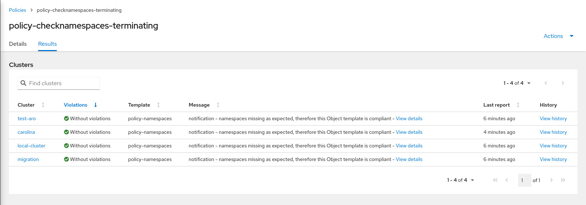
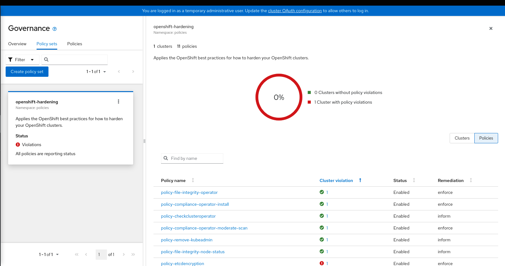
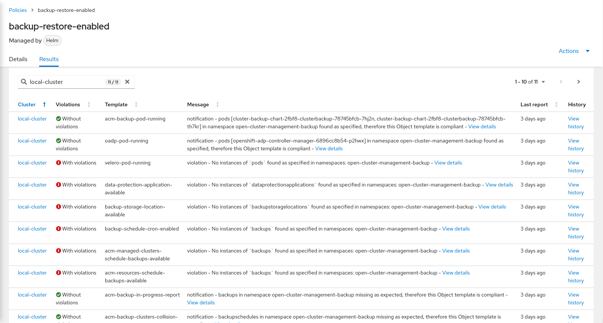
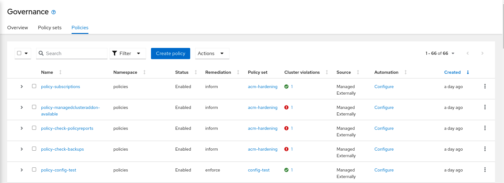

## ArgoCD and Red Hat Advanced Cluster Management-Policies: Better together

In this blog, we are going to explore the relationship between OpenShift GitOps (Argo CD) and Red Hat Advanced Cluster Management's (RHACM's) policy framework and how they fit together.
While RHACM is Red Hat’s solution for Kubernetes `MultiClusterManagement` with a strong focus on Governance, OpenShift GitOps (Argo CD) is a very popular Gitops-Engine which is used by many customers and which just reached CNCF's [graduated](https://www.cncf.io/announcements/2022/12/06/the-cloud-native-computing-foundation-announces-argo-has-graduated/ ) status.

This blog is not covering a general introduction to policies, for this it is highly recommended to check the [list](https://github.com/open-cluster-management-io/policy-collection/tree/main/blogs) of existing blogs on all details of RHACM's-Governance Framework.  

In the following we will list the advantages of deploying RHACM-Policies using Argo CD showing several `real-world` examples.


## Advantages of using Policies with ArgoCD

1. RHACM-Policies can be used to install and configure Argo CD consistently either on the Managing or on Managed-Clusters. See    an example [here](https://github.com/stolostron/policy-collection/blob/main/community/CM-Configuration-Management/policy-openshift-gitops.yaml).
   The Policy is marked as part of the `Baseline-Configuration` of the `NIST SP 800-53` standard and could certainly be part of    any other standard you like to implement.

   ```
      kind: Policy
      metadata:
        name: example-policy
        annotations:
          policy.open-cluster-management.io/standards: NIST SP 800-53
          policy.open-cluster-management.io/categories: CM Configuration Management
          policy.open-cluster-management.io/controls: CM-2 Baseline Configuration
   ```

   as an example you could consistently overwrite the default Gitops-Instance in all your namespaces and environments.

   ```
      spec:
        channel: stable
        config:
          env:
          - name: DISABLE_DEFAULT_ARGOCD_INSTANCE
            value: "true"
          - name: ARGOCD_CLUSTER_CONFIG_NAMESPACES
            value: <namespace to deploy to>
   ```

   another example would be to configure [SSO](https://docs.openshift.com/container-platform/4.11/cicd/gitops/configuring-sso-for-argo-cd-using-keycloak.html) for your `fleet` of Gitops-Instances.

   ```
      spec:
        sso:
          provider: keycloak
   ```
   It offers you the option to `enforce` and `monitor` the settings of `Gitops-Operator/ArgoCD` regardless if you have a  
  `centralized` or `decentralized` approach. This means you can consistently rollout 
   the configuration to your fleet of clusters avoiding any issues which might come from `inconsistencies` e.g. regarding RBAC    and which are else difficult to troubleshoot.
   
   

2. You get `advanced templating features` optimized for `Multi-Cluster-Management` which includes `Secrets-Management` where 
   you can securely copy a secret from the Hub to a ManagedCluster like in the example below:

   ```
      objectDefinition:
        apiVersion: v1
        data:
          city: '{{hub fromSecret "" "hub-secret" "city" hub}}'
          state: '{{hub fromSecret "" "hub-secret" "state" hub}}'
        kind: Secret
        metadata:
          name: copied-secret
          namespace: target
   ```

   The following example shows you how to dynamically configure a `LimitRange` and a `ResourceQuota`:

   ```
      apiVersion: v1
      kind: LimitRange
      metadata:
        name: mem-limit-range
        namespace: '{{hub fromConfigMap "" "app-box-config"  (printf "%s-namespace" .ManagedClusterName) hub}}'
      spec:
        limits:
        - default:
            memory: '{{hub fromConfigMap "" "app-box-config"  (printf "%s-memory-limit" .ManagedClusterName) hub}}'
          defaultRequest:
            memory: '{{hub fromConfigMap "" "app-box-config"  (printf "%s-memory-request" .ManagedClusterName) hub}}'
          type: Container
      ---
      apiVersion: v1
      kind: ResourceQuota
      metadata:
        name: compute-resources
        namespace: '{{hub fromConfigMap "" "app-box-config"  (printf "%s-namespace" .ManagedClusterName) hub}}'
      spec:
        hard:
          requests.cpu: "1"
          requests.memory: 1Gi
          limits.cpu: "2"
          limits.memory: 2Gi
          requests.nvidia.com/gpu: 4
   ```
   
   `Benefits` of this approach are among others that there is no `duplication` of policies (and thus easier maintenance) as you     customize specific elements of a policy over various clusters within the fleet.


3.  RHACM Policy framework provides the option to generate resources (e.g `Roles`, `Rolebindings`) in one or several namespaces
    based on namespace `names`, `labels` or `expressions`.

    In RHACM version 2.6 - as you see below - we enhanced our `namespaceSelector` to chose namespaces also by `label` and          `expression` which gives you more flexibility on which namespaces you like to operate on:

    ```
       namespaceSelector:
         matchLabels:
           name: test2
         matchExpressions:
           key: name
           operator: In
           values: ["test1", "test2"]
    ```
    Benefit of this feature is that it reduces significantly the Policies you need to configure, e.g. when you want to copy a
   `ConfigMap` into several namespace or only into the namespaces with a certain name or label.


4.  You have the capability to merge or patch resources. This means if a Kubernetes-Object has to contain certain values you
    specify `musthave` in case you can tolerate other fields.
    Else - if the object must match exactly - you have to specify `mustonlyhave`.

    A often requested example for `mustonlyhave` is to disable the `self-provisioner role` from an existing or newly created
    OpenShift-Cluster:
   
    ```
        metadata:
          name: policy-remove-self-provisioner
        spec:
          remediationAction: enforce
          severity: high
          object-templates:
            - complianceType: mustonlyhave
              objectDefinition:
                kind: ClusterRoleBinding
                apiVersion: rbac.authorization.k8s.io/v1
                metadata:
                  name: self-provisioners
                  annotations:
                    rbac.authorization.kubernetes.io/autoupdate: 'false'
                subjects: []
                roleRef:
                  apiGroup: rbac.authorization.k8s.io
                  kind: ClusterRole
                  name: self-provisioner
    ```

5.  We provide the option to just monitor resources instead of creating/patching them (can be configured via `inform`, versus
    `enforce`). It is possible to monitor the status of `any` Kubernetes-Object.
    In the following case we check for namespaces in `terminating` status.

    ```
       spec:
        remediationAction: inform
        severity: low
        object-templates:
        - complianceType: mustnothave
          objectDefinition:
            apiVersion: v1
            kind: Namespace
            status:
            phase: Terminating
    ```

   In this example none of the 4 evaluated Clusters has such a violation.

   

6. Similar to above we provide the option to `delete` certain objects, you would just set the `remediationAction` to `enforce`.

   Please check here for more [examples](https://github.com/stolostron/governance-policy-framework/blob/main/doc/configuration-policy/README.md#basic-usage) regarding the previous points.

   Please note that one of the most interesting usecases here is to delete the `kubeadmin-secret` from the managed-clusters.
  
   The capability to delete objects is enhanced by specifying a `prune-object-behavior` so you can decide what should happen
   with the objects once you delete a Policy. Please review here [Prune Object Behavior](https://access.redhat.com/documentation/en-us/red_hat_advanced_cluster_management_for_kubernetes/2.6/html/governance/governance#cleaning-up-resources-from-policies). 

7. RHACM's Governance framework provides the option to group objects to certain sets (`PolicySets`), a feature which has both
   UI and Gitops-Support.
   - See how `PolicySets` can be configured using [PolicyGenerator](https://github.com/stolostron/policy-collection/blob/main/policygenerator/policy-sets/community/openshift-plus/policyGenerator.yaml#L154)
   - See an example of a `PolicySet` being stored in git by checking:

   ```
      apiVersion: policy.open-cluster-management.io/v1beta1
      kind: PolicySet
        metadata:
          name: certificates-policyset
          namespace: cert-manager
        spec:
          description: "Grouping policies related to certificate handling"
        policies:
        - azure-clusterissuer-policy
        - cert-manager-csv-policy
        - certification-expiration-policy
   ```

   - See how they look in the UI (examples taken from our [Kyverno-Policysets](https://github.com/stolostron/policy-collection/tree/main/policygenerator/policy-sets/community/kyverno)):


   - See how the [OpenShift-Hardening-Policyset](https://github.com/stolostron/policy-collection/tree/main/policygenerator/policy-sets/community/openshift-hardening) looks like. You see some policies are   
     compliant, some others are not and need investigation.




8. You have the possibility to configure how often checks should be evaluated considering the current status of an evaluated  
   Object.

   ```
      spec:
        evaluationInterval:
        compliant: 10m
        noncompliant: 10s
   ```
   or for one time jobs
   ```
      spec.evaluationInterval.compliant: never
   ```

   The above example stops evaluating the policy once it is in compliant state. So it enforces it only once.
   The feature has mainly the advantage to tune environments with many policies to consume less resources.

9. You can use `PolicyGenerator` which also can be used for integration of `Kyverno` and `Gatekeeper`. 
   The PolicyGenerator is a Kustomize plugin to wrap Kubernetes manifests in Policies and also generate PolicySets. Generation    can be done locally or through GitOps. We restrict generation sources to local subdirectories for security but starting with 
   RHACM 2.7 the path can point to a Kustomize directory, which allows additional levels of customization as well as supplying 
   a remote URL in the Kustomize file.
 
  `PolicyGenerator` can be used in ArgoCD to transform `yaml-resources` to Policies at Runtime. The integration works via  
   Custom Tooling as you see [here](https://argo-cd.readthedocs.io/en/stable/operator-manual/custom_tools/).

   Please note that you can also generate Policies from folders which contain a `Kustomization`.
   Let's check the following example-extract:

   ```
      policies:
        - name: policy-gatekeeperlibrary
          manifests:
            - path: gatekeeperlibrary
   ```
   points to

   ```
      apiVersion: kustomize.config.k8s.io/v1beta1
      kind: Kustomization
      resources:
        - https://github.com/ch-stark/gatekeeper-library/library     
     
   ```

   ### Migrate from PlacementRules to Placement using PolicyGenerator
      
   Another nice feature of `PolicyGenerator` is that it helps you to upgrade from `PlacementRules` to the new `Placement-API`.
   You see in above file that there is both the option to set a `PlacementRule` or a `Placement`. You can either specify a name
   (when the object already exists in the Cluster) or a path in the Gitrepo to apply the objects. See:  
   `placementPath`,`placementName` or `placementRulePath` and `placementRuleName` in the reference file [here](https://github.com/stolostron/policy-generator-plugin/blob/main/docs/policygenerator-reference.yaml).


10. Governance focused UI-support (Governance-Dashboard) which enables you to drill down into errors from every single Policy.

    See here for an overall Governance overview in RHACM-UI:
   
    

    See here example of our `build-in policy` which checks if backup is setup correctly:
   


11. Option to have less or more fine grained checks by using Configuration-Policies.

    This means you can create one `Configuration Policy` for every single Kubernetes-Object or bundle many of them. Each 
   `Configuration Policy` will be one unit when it comes to check the status in the UI as you see in the screenshot above.
    Benefit is that it gives you more flexibility when developing custom checks. 

12. Monitoring- and Ansible-integration (gives you the option to implement `Automated Governance`).

    Those topics have already been explained in several blogs which can be found [here](https://github.com/stolostron/policy-collection/tree/main/blogs) just to summarize:
  
    - you can give Policies a `severity` sending alerts via `RHACM's Observability` framework only from high-prio policies
    - you can invoke Ansible-Jobs from Policies so you could only invoke Ansible from critical policies
    - you could use the previously discussed `evaluationInterval` to trigger an Ansible Job at a regular basis.
   
   ### Running the example
   
   Starting with ACM 2.7 the best way to setup the example and to provide a nice onboarding experience to to apply those  
   policies using the new dependency feature:

   For quickly installing the below policies just execute:
   
   ```
   oc apply -f https://raw.githubusercontent.com/ch-stark/argocdpoliciesblog/main/setuppolicies/policies/openshift-gitops-installed.yaml
   oc apply -f https://raw.githubusercontent.com/ch-stark/argocdpoliciesblog/main/setuppolicies/policies/openshift-gitops-policygenerator.yaml
   oc apply -f https://raw.githubusercontent.com/ch-stark/argocdpoliciesblog/main/setuppolicies/policies/policy-application-gatekeeper.yaml
   ```

   This policy configures ArgoCD with PolicyGenerator and it requires GitopsOperator to be installed.
   
   ```
      apiVersion: policy.open-cluster-management.io/v1
      kind: Policy
      metadata:
        name: openshift-gitops-policygenerator
        annotations:
          policy.open-cluster-management.io/standards: NIST SP 800-53
          policy.open-cluster-management.io/categories: CM Configuration Management
          policy.open-cluster-management.io/controls: CM-2 Baseline Configuration
      spec:
        remediationAction: inform
        disabled: false
        dependencies:
        - apiVersion: policy.open-cluster-management.io/v1
          compliance: Compliant
          kind: Policy
          name: openshift-gitops-installed
        policy-templates:
          - objectDefinition:
              apiVersion: policy.open-cluster-management.io/v1
              kind: ConfigurationPolicy
              metadata:
                name: openshift-gitops-policygenerator
              spec:
                dependencies:
                  - name: openshift-gitops-policygenerator
                    apiVersion: policy.open-cluster-management.io/v1
                    compliance: Compliant
                    kind: Policy        
                remediationAction: inform
                severity: medium
                object-templates:
                  - complianceType: musthave
                    objectDefinition:
                      apiVersion: argoproj.io/v1alpha1
                      kind: ArgoCD
                      metadata:
                        name: openshift-gitops
                        namespace: openshift-gitops
                      spec:
                        repo:
                          env:
                          - name: KUSTOMIZE_PLUGIN_HOME
                            value: /etc/kustomize/plugin
                          initContainers:
                          - args:
                            - -c
                            - cp /etc/kustomize/plugin/policy.open-cluster-management.io/v1/policygenerator/PolicyGenerator
                              /policy-generator/PolicyGenerator
                            command:
                            - /bin/bash
                            image: registry.redhat.io/rhacm2/multicluster-operators-subscription-rhel8:v2.7
                            name: policy-generator-install
                            volumeMounts:
                            - mountPath: /policy-generator
                              name: policy-generator
                          volumeMounts:
                          - mountPath: /etc/kustomize/plugin/policy.open-cluster-management.io/v1/policygenerator
                            name: policy-generator
                          volumes:
                          - emptyDir: {}
                            name: policy-generator
                        kustomizeBuildOptions: --enable-alpha-plugins
                  - complianceType: musthave
                    objectDefinition:
                      kind: ClusterRole
                      apiVersion: rbac.authorization.k8s.io/v1
                      metadata:
                        name: openshift-gitops-policy-admin
                      rules:
                        - verbs:
                            - get
                            - list
                            - watch
                            - create
                            - update
                            - patch
                            - delete
                          apiGroups:
                            - policy.open-cluster-management.io
                          resources:
                            - policies
                            - placementbindings
                        - verbs:
                            - get
                            - list
                            - watch
                            - create
                            - update
                            - patch
                            - delete
                          apiGroups:
                            - apps.open-cluster-management.io
                          resources:
                            - placementrules
                        - verbs:
                            - get
                            - list
                            - watch
                            - create
                            - update
                            - patch
                            - delete
                          apiGroups:
                            - cluster.open-cluster-management.io
                          resources:
                            - placements
                            - placements/status
                            - placementdecisions
                            - placementdecisions/status
                  - complianceType: musthave
                    objectDefinition:
                      kind: ClusterRoleBinding
                      apiVersion: rbac.authorization.k8s.io/v1
                      metadata:
                        name: openshift-gitops-policy-admin
                      subjects:
                        - kind: ServiceAccount
                          name: openshift-gitops-argocd-application-controller
                          namespace: openshift-gitops
                      roleRef:
                        apiGroup: rbac.authorization.k8s.io
                        kind: ClusterRole
                        name: openshift-gitops-policy-admin
      ---
      apiVersion: policy.open-cluster-management.io/v1
      kind: PlacementBinding
      metadata:
        name: binding-openshift-gitops-policygenerator
      placementRef:
        name: placement-openshift-gitops-policygenerator
        kind: PlacementRule
        apiGroup: apps.open-cluster-management.io
      subjects:
        - name: openshift-gitops-policygenerator
          kind: Policy
          apiGroup: policy.open-cluster-management.io
      ---
      apiVersion: apps.open-cluster-management.io/v1
      kind: PlacementRule
      metadata:
        name: placement-openshift-gitops-policygenerator
      spec:
        clusterSelector:
          matchExpressions:
            - {key: name, operator: In, values: ["local-cluster"]}
      apiVersion: policy.open-cluster-management.io/v1
    
   ```
   
   This Policy installs an Application, in the following Gatekeeper will be installed
    
   
   ```
      
      ---
      kind: Policy
      metadata:
        name: policy-gatekeeper-application
        namespace: default
        annotations:
          policy.open-cluster-management.io/categories: CM Configuration Management
          policy.open-cluster-management.io/standards: NIST SP 800-53
          policy.open-cluster-management.io/controls: CM-2 Baseline Configuration
      spec:
        disabled: false
        dependencies:
        - apiVersion: policy.open-cluster-management.io/v1
          compliance: Compliant
          kind: Policy
          name: openshift-gitops-policygenerator
        policy-templates:
          - objectDefinition:
              apiVersion: policy.open-cluster-management.io/v1
              kind: ConfigurationPolicy
              metadata:
                name: policy-application-gatekeeper
              spec:
                remediationAction: inform
                severity: low
                namespaceSelector:
                  exclude:
                    - kube-*
                  include:
                    - default
                object-templates:
                  - complianceType: musthave
                    objectDefinition:
                      apiVersion: argoproj.io/v1alpha1
                      kind: Application
                      metadata:
                        name: policiesgatekeeper
                        namespace: openshift-gitops
                      spec:
                        destination:
                          namespace: openshift-gitops
                          server: https://kubernetes.default.svc
                        project: default
                        source:
                          path: .
                          repoURL: https://github.com/ch-stark/gatekeeper-examples
                          targetRevision: HEAD
                        syncPolicy:
                          syncOptions:
                            - CreateNamespace=true
                          automated:
                            selfHeal: false
                            prune: true
                pruneObjectBehavior: DeleteIfCreated
      ---
      apiVersion: policy.open-cluster-management.io/v1
      kind: PlacementBinding
      metadata:
        name: gatekeeper-application-placement
        namespace: default
      placementRef:
        name: placement-openshift-gitops-policygenerator
        apiGroup: apps.open-cluster-management.io
        kind: PlacementRule
      subjects:
        - name: gatekeeper-application
          apiGroup: policy.open-cluster-management.io
          kind: Policy
   
   ```

   See some of the Policies being synced onto the Hub-Cluster using ArgoCD-Applications in the `Governance-View`.
   

## Fixing the issues that ArgoCD gets out of sync and monitoring the solution

   A nice example how ArgoCD can be configured to optimize the interaction with RHACM-policies has been the following. It   
   turned out that as the RHACM-Policy-Controller is copying Policies into a namespace (representing a managed cluster)
   therefore `ArgoCD-Applications` became `out-of-sync`. This can be fixed by setting the `resource tracking` method to
   [label](https://argocd-operator.readthedocs.io/en/latest/reference/argocd/#resource-tracking-method) which is 
   already included in the examples.

   For monitoring you can benefit from RHACM's `Gatekeeper Integration` by using this `Gatekeeper-Constraint` together with 
   PolicyGenerator.

   ```
      ---
      # Require applications deploy with ArgoProj
      # To use this, set Argo CD tracking method to annotation or annotation+label. https://argo-cd.readthedocs.io/en/stable/user-      guide/resource_tracking/
      apiVersion: constraints.gatekeeper.sh/v1beta1
      kind: K8sRequiredAnnotations
      metadata:
        name: must-be-deployed-by-argocd
      spec:
        enforcementAction: deny
        match:
          namespaces:
            - "*"
          kinds:
            - apiGroups: [""]
              kinds: ["ReplicaSet", "Deployment"]
        parameters:
          message: "All resources must have a `argocd.argoproj.io/tracking-id` annotation."
          annotations:
            - key: argocd.argoproj.io/tracking-id
              # Matches annotation format
              allowedRegex: ^[a-zA-Z0-9-]+:.+$
   ```

### Summary

   This overview had the purpose to explain why it is a good idea to use Policies together with `GitOpsOperator/ArgoCD`. Both      approaches can heavily benefit from each other. Certainly it needs to be highlighted that the focus of RHACM-Policies is to 
   support customers becoming `compliant` from a technical point of view. It can be even seen as a `ArgoCD extension to
   Governance`. You get all the great benefits highlighted above out of the box.
   Both `sites` will provide further features in the future like enhanced `Operator` Management and we think of
   further integration possibilities. We would love to get your feedback and thoughts on this topic.
